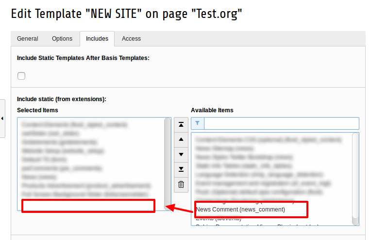

Installation
------------

.. important::

   Install the Extension News System version 5.1.0 before start installing process of News Comment Extension.

The extension needs to be installed as any other extension of TYPO3 CMS:

Get the extension

    **Get it from typo3.org:** You can always get current version from
      `https://typo3.org/extensions/repository/view/news_comment
      <https://typo3.org/extensions/repository/view/news_comment>`_ by
      downloading either the t3x or zip version. Upload
      the file afterwards in the Extension Manager.

Include static TypoScript
-------------------------

The extension requires some TypoScript code which needs to be included.

#. Switch to the root page of your site.

#. Switch to the **Template module** and select *Info/Modify*.

#. Click to the link **Edit the whole template record** and switch to the tab *Includes*.

#. Select **News Comment (news_comment)** at the field *Include static (from extensions):*

	Include static template for news_comment
